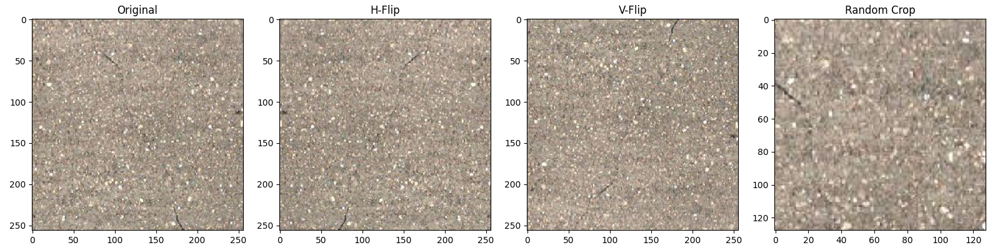
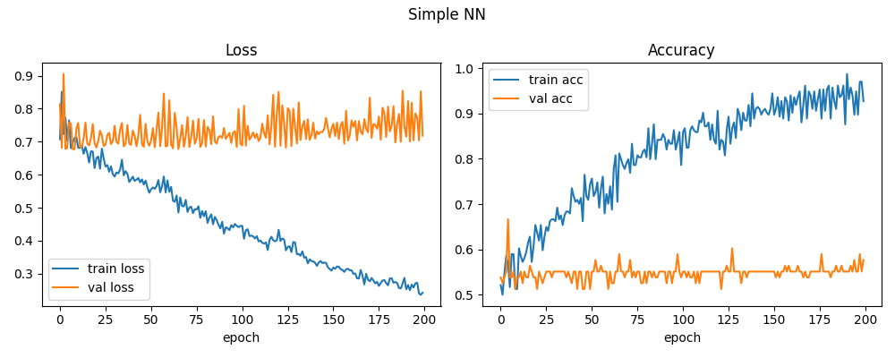
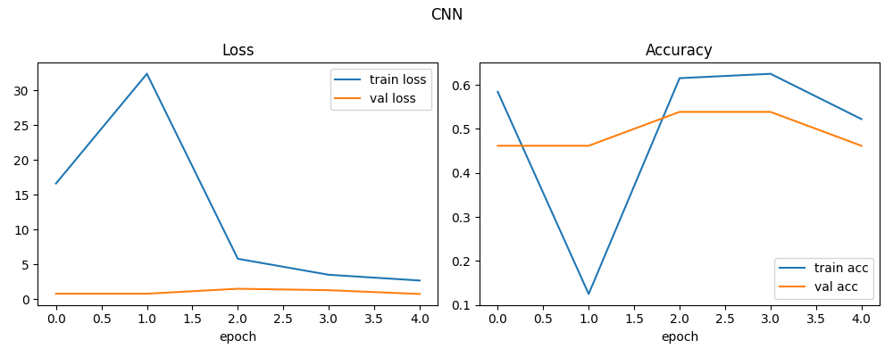
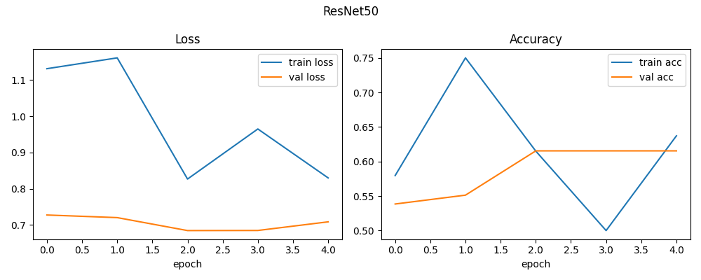
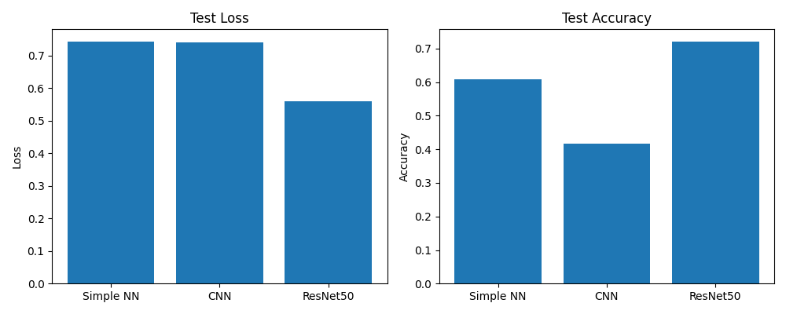

# Road Damage Classification — Experiment Report

**Generated:** 2026-06-11 15:46:23

---
## 1. Dataset

| Class | Count | Ratio |
|---|---|---|
| 000_damage    | 167   | 42.7% |
| 001_no_damage | 224 | 57.3% |
| **Total**     | **391**  | 100% |

- 画像サイズ: 256×256 (RGB) または 224×224 (ResNet)
- Split: Train 60% / Validation 20% / Test 20% (random_seed=1)
- **クラス不均衡に注意:** no_damage が damage より約 1.3 倍多い。
  Accuracy だけで評価すると常に多数クラスを予測するだけで高スコアが出る可能性がある。

---
## 2. Image Augmentation

学習データに以下のオーグメンテーションを適用して過学習を抑制した。

| 手法 | 効果 |
|---|---|
| Horizontal Flip | 左右反転による位置不変性の学習 |
| Vertical Flip   | 上下反転（道路画像では稀だが汎化に貢献） |
| Width/Height Shift (±10%) | 小さな位置ずれへの頑健性 |
| Zoom (±10%)     | スケール変動への対応 |
| Rotation (±10°) | 微小な傾きへの頑健性 |

---
## 3. モデル構成

### Model 1: Simple Neural Network
- 入力: 256×256 グレースケール → Flatten (65536次元)
- Dense(512, ReLU) → Dropout(0.2) → Dense(512, ReLU) → Dropout(0.2) → Dense(2, Softmax)
- Optimizer: Adam(lr=0.01) / Epochs: 200 / Batch: 128
- **特徴:** 最もシンプルな全結合ネット。空間情報は完全に失われる。

### Model 2: CNN
- 入力: 256×256 RGB
- BatchNorm → Conv2D(64, 7×7) → MaxPool → Dropout(0.4)
- BatchNorm → Conv2D(128, 3×3) → MaxPool → Dropout(0.4)
- BatchNorm → Conv2D(256, 5×5) → MaxPool → Dropout(0.4)
- Flatten → Dense(256, ELU) → Dropout(0.5) → Dense(2, Softmax)
- Optimizer: AdamW(lr=0.0001) / Epochs: 5 / Batch: 8
- **特徴:** 空間的な特徴（エッジ・テクスチャ）を階層的に抽出する。

### Model 3: ResNet50 (転移学習)
- 入力: 224×224 RGB
- ResNet50 (ImageNet事前学習済み, include_top=True)
- Flatten → Dense(256, ELU) → Dropout(0.5) → Dense(2, Softmax)
- Optimizer: AdamW(lr=0.0001) / Epochs: 5 / Batch: 8
- **特徴:** 2500万パラメータ超の深層ネット。ImageNetの大規模事前学習により、少ないデータでも豊富な特徴表現を利用できる（転移学習）。

---
## 4. 各モデルの結果

### 4-1. Simple NN

**Hyperparameters:** Epochs=200, Batch=128, Optimizer=Adam(lr=0.01)

#### 学習曲線

#### テスト結果

| Metric | Value |
|---|---|
| Test Loss     | 0.7439 |
| Test Accuracy | 0.6076 (60.8%) |
| TP (正解: damage,    予測: damage)    | 3 |
| TN (正解: no_damage, 予測: no_damage) | 45 |
| FN (damage を見逃し)                  | 30 |
| FP (no_damage を damage と誤検知)     | 1 |
| テスト画像数                          | 79 |

#### Confusion Matrix

| | Pred: damage | Pred: no_damage |
|---|---|---|
| **Actual: damage**    | 3 (TP) | 30 (FN) |
| **Actual: no_damage** | 1 (FP) | 45 (TN) |

#### Classification Report

| Class | Precision | Recall | F1-score | Support |
|---|---|---|---|---|
| 000_damage | 0.750 | 0.091 | 0.162 | 33 |
| 001_no_damage | 0.600 | 0.978 | 0.744 | 46 |
| **weighted avg** | 0.663 | 0.608 | 0.501 | 79 |

#### コメント
- **Accuracy 60.8%** は一見低いが、クラス不均衡（no_damage多数）を考慮する必要がある。
- damage クラスの **Recall = 0.091** (9.1%) ← 実際の損傷のうち何割を検出できたか。道路管理の観点では**最重要指標**。見逃し(FN)=30件。
- damage クラスの **Precision = 0.750** ← damage と予測したうち本当に損傷だった割合。誤警報(FP)=1件。
- **F1-score (damage) = 0.162** ← PrecisionとRecallの調和平均。クラス不均衡下での総合指標。

### 4-2. CNN

**Hyperparameters:** Epochs=5, Batch=8, Optimizer=AdamW(lr=0.0001)

#### 学習曲線

#### テスト結果

| Metric | Value |
|---|---|
| Test Loss     | 0.7411 |
| Test Accuracy | 0.4177 (41.8%) |
| TP (正解: damage,    予測: damage)    | 33 |
| TN (正解: no_damage, 予測: no_damage) | 0 |
| FN (damage を見逃し)                  | 0 |
| FP (no_damage を damage と誤検知)     | 46 |
| テスト画像数                          | 79 |

#### Confusion Matrix

| | Pred: damage | Pred: no_damage |
|---|---|---|
| **Actual: damage**    | 33 (TP) | 0 (FN) |
| **Actual: no_damage** | 46 (FP) | 0 (TN) |

#### Classification Report

| Class | Precision | Recall | F1-score | Support |
|---|---|---|---|---|
| 000_damage | 0.418 | 1.000 | 0.589 | 33 |
| 001_no_damage | 0.000 | 0.000 | 0.000 | 46 |
| **weighted avg** | 0.174 | 0.418 | 0.246 | 79 |

#### コメント
- **Accuracy 41.8%** は一見低いが、クラス不均衡（no_damage多数）を考慮する必要がある。
- damage クラスの **Recall = 1.000** (100.0%) ← 実際の損傷のうち何割を検出できたか。道路管理の観点では**最重要指標**。見逃し(FN)=0件。
- damage クラスの **Precision = 0.418** ← damage と予測したうち本当に損傷だった割合。誤警報(FP)=46件。
- **F1-score (damage) = 0.589** ← PrecisionとRecallの調和平均。クラス不均衡下での総合指標。

### 4-3. ResNet50

**Hyperparameters:** Epochs=5, Batch=8, Optimizer=AdamW(lr=0.0001)

#### 学習曲線

#### テスト結果

| Metric | Value |
|---|---|
| Test Loss     | 0.5606 |
| Test Accuracy | 0.7215 (72.2%) |
| TP (正解: damage,    予測: damage)    | 26 |
| TN (正解: no_damage, 予測: no_damage) | 31 |
| FN (damage を見逃し)                  | 7 |
| FP (no_damage を damage と誤検知)     | 15 |
| テスト画像数                          | 79 |

#### Confusion Matrix

| | Pred: damage | Pred: no_damage |
|---|---|---|
| **Actual: damage**    | 26 (TP) | 7 (FN) |
| **Actual: no_damage** | 15 (FP) | 31 (TN) |

#### Classification Report

| Class | Precision | Recall | F1-score | Support |
|---|---|---|---|---|
| 000_damage | 0.634 | 0.788 | 0.703 | 33 |
| 001_no_damage | 0.816 | 0.674 | 0.738 | 46 |
| **weighted avg** | 0.740 | 0.722 | 0.723 | 79 |

#### コメント
- **Accuracy 72.2%** は一見高いが、クラス不均衡（no_damage多数）を考慮する必要がある。
- damage クラスの **Recall = 0.788** (78.8%) ← 実際の損傷のうち何割を検出できたか。道路管理の観点では**最重要指標**。見逃し(FN)=7件。
- damage クラスの **Precision = 0.634** ← damage と予測したうち本当に損傷だった割合。誤警報(FP)=15件。
- **F1-score (damage) = 0.703** ← PrecisionとRecallの調和平均。クラス不均衡下での総合指標。

---
## 5. モデル比較

| Model | Test Loss | Test Accuracy | damage F1 | damage Recall | FN (見逃し) | FP (誤検知) |
|---|---|---|---|---|---|---|
| Simple NN | 0.7439 | 0.6076 | 0.162 | 0.091 | 30 | 1 |
| CNN | 0.7411 | 0.4177 | 0.589 | 1.000 | 0 | 46 |
| ResNet50 | 0.5606 | 0.7215 | 0.703 | 0.788 | 7 | 15 |

### 考察

- **Accuracy 最高:** ResNet50
- **Loss 最小:** ResNet50
- **damage Recall 最高:** CNN

道路損傷検出では**見逃し(FN)のコストが最も高い**（損傷を放置すると事故リスク）。
そのため Accuracy よりも **damage クラスの Recall** を重視して最終モデルを選定すべきである。

転移学習(ResNet50)はパラメータ数が多い一方、今回のような小規模データセット(391枚)では
少ないエポック数でも十分な特徴を引き出せる可能性がある。
一方 Simple NN は空間情報を失うため、画像分類には構造的に不利である。
CNNは今回のデータ規模に適した中間的な選択肢といえる。

---
## 6. 出力ファイル一覧

| ファイル | 内容 |
|---|---|
| `image_augmentation.png` | オーグメンテーション例（Original/H-Flip/V-Flip/Crop） |
| `history_simple_nn.png` | Simple NN の学習曲線 |
| `history_cnn.png` | CNN の学習曲線 |
| `history_resnet.png` | ResNet50 の学習曲線 |
| `comparison.png` | 3モデルのLoss・Accuracy棒グラフ比較 |
| `SimpleNN/error_TP_*.png` | Simple NNの正解(TP)画像 |
| `SimpleNN/error_TN_*.png` | Simple NNの正解(TN)画像 |
| `SimpleNN/error_FN_*.png` | Simple NNの見逃し(FN)画像 |
| `SimpleNN/error_FP_*.png` | Simple NNの誤検知(FP)画像 |
| `CNN/error_*.png` | CNN の誤分類・正解画像 |
| `ResNet50/error_*.png` | ResNet50 の誤分類・正解画像 |
| `report.md` | 本レポート |
