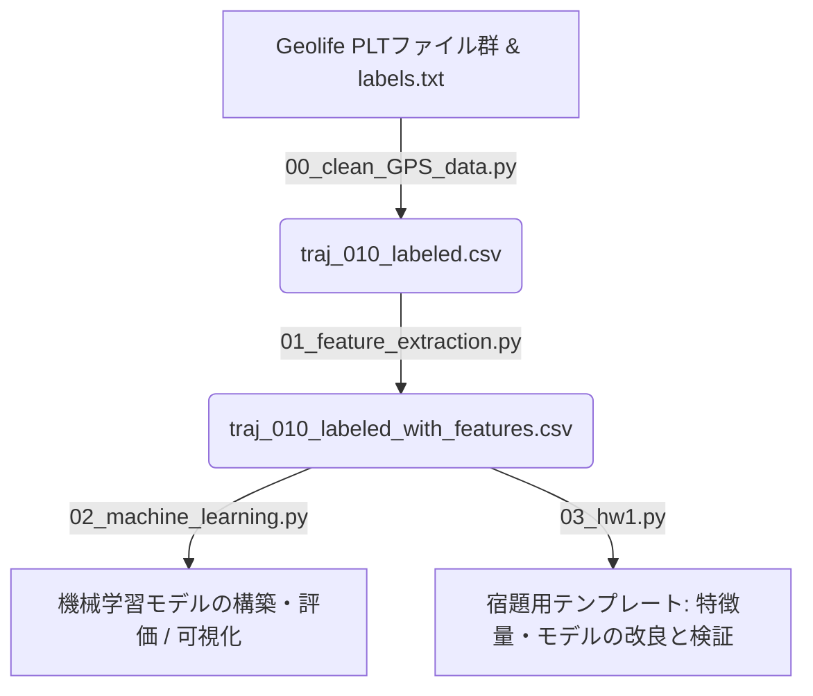

# Geolife GPS軌跡データを用いた移動手段判定（Transportation Mode Detection）コード解説ドキュメント

本ドキュメントでは、フォルダ内にある4つの主要なPythonスクリプト（`00_clean_GPS_data.py`, `01_feature_extraction.py`, `02_machine_learning.py`, `03_hw1.py`）について、処理の詳細、データパイプライン、最新の改善内容（非ブロッキング可視化と自動保存の導入）、および宿題（Homework 1）の実証結果について詳しく説明します。

---

## 全体のデータ処理パイプライン概要

このプロジェクトは、Microsoft Researchが公開しているGPS軌跡データセット「Geolife Trajectories 1.3」のうち、ユーザー `010` のデータを使用して、GPSの時系列データからその時の移動手段（徒歩、電車、車/バスなど）を推定する機械学習モデルを構築するものです。

データ処理の流れは以下の通りです：



---

## 1. 00_clean_GPS_data.py (データ前処理・ラベル紐付け)

このスクリプトは、ユーザー `010` の生のGPS軌跡データと、移動手段の「正解ラベル（Ground Truth）」が記録されたファイルを読み込んで統合し、クレンジングされたCSVファイルを出力します。

### 主要な処理ステップ
1. **GPS軌跡データ（PLT形式）の読み込み**
   - `./Geolife Trajectories 1.3/Data/010/Trajectory/` にあるすべての `.plt` ファイルをリストアップします。
   - 各PLTファイルは最初の6行がヘッダーであるため、`skiprows=6` を指定して読み込みます。
   - 必要な列として、緯度（`latitude`）、経度（`longitude`）、高度（`height`）、日付（`date`）、時刻（`time`）を取得し、日時のタイムスタンプ列 `record_dt` を作成して、ひとつのDataFrameに統合します。
2. **正解ラベルデータの読み込み**
   - 同ディレクトリ内にある正解ラベルファイル `labels.txt` を読み込みます。
   - `Start Time`（開始時刻）と `End Time`（終了時刻）を日時の形式に変換します。
3. **時間帯に基づく移動手段（Transportation Mode）のマッピング**
   - 各GPSレコードの記録時刻（`record_dt`）が、正解ラベルに定義されたトリップの `Start Time` から `End Time` の間にあるかどうかを判定します（`get_trans_trip` 関数）。
   - マッピングできた場合は、トリップIDと移動手段名（`Transportation Mode`：徒歩、バス、電車など）を各GPSレコードに付与します。
4. **データの出力**
   - ラベルが付与されたGPSレコードを抽出し、`traj_010_labeled.csv` として保存します。

---

## 2. 01_feature_extraction.py (特徴量抽出・可視化)

移動手段の判定精度を向上させるため、GPSの座標情報（緯度・経度）と時間情報から、速度や加速度、方位角の変化などの物理的な特徴量を計算します。

### 主要な処理ステップ
1. **データのソートと時間差計算**
   - `traj_010_labeled.csv` を読み込み、移動手段（`trans_mode`）が欠損しているレコードを除去します。
   - データをトリップ（`trans_trip`）およびタイムスタンプ（`timestamp`）順にソートします。
   - トリップごとに、1つ前のレコードとの時間差（`time_delta` および秒換算 `dt_seconds`）を算出します。
2. **特定モードの除外**
   - 今回のユーザー `010` は飛行機（airplane）と自動車（car）のデータが極めて少ないため、分析のノイズを減らすためにこれらを除外します。
3. **各種特徴量の算出**
   - 前後のレコードの座標や速度の変化から、以下の物理量を計算します：
     * **距離（`distance`）**: ハーバーサイン公式（大圏距離）を用いて、地球の丸みを考慮した隣接ポイント間の距離（km）を計算します。
     * **速度（`speed`）**: `距離 / 時間差` から、時速（km/h）を計算します。
     * **加速度（`accel`）**: 前後の速度の差分を時間差で割ることで算出します（km/h/s 相当）。
     * **方位角（`angle`）**: 1つ前の座標から現在の座標への進路方向（0〜360度）を計算します。
     * **角速度（`angular_velocity`）**: 方位角の変化量を時間差で割ることで、旋回の激しさを表す角速度（deg/s）を計算します。
4. **データの出力**
   - 計算された特徴量を追加し、`traj_010_labeled_with_features.csv` として出力します。

### 可視化の挙動向上と自動保存
グラフ描画処理において、手動でウィンドウを閉じないと処理がブロックされる問題を解消し、自動保存と自動クローズの仕組みを組み込みました。

```python
plt.savefig('ファイル名.png')
plt.show(block=False)  # 実行を止めずに描画
plt.pause(2.0)         # 2秒間表示
plt.close()            # 自動でウィンドウを閉じる
```

* **生成・保存される画像**:
  * `plot_speed_vs_angular_velocity.png` (トリップごとの平均速度と平均角速度の散布図)
  * `plot_acceleration_boxplot.png` (移動手段ごとの平均加速度の箱ひげ図)

---

## 3. 02_machine_learning.py (機械学習モデルの構築と評価)

抽出した特徴量データを用い、教師あり学習（3種類の分類器）と教師なし学習（クラスタリング、次元削減）を実行してモデルの性能を比較・評価します。

### 主要な処理ステップ
1. **トリップ単位での特徴量の集計**
   - レコード単位ではなく、1つのトリップ（`trans_trip`）全体での特徴量の平均値（`mean`）を算出します。
2. **ラベルの統合（クラスの再定義）**
   - 表現のばらつきを抑えるため、移動手段を以下の3つの主要なカテゴリにマッピング・統合します：
     * `walk` ➔ 徒歩（`walk`）
     * `train` ➔ 電車・地下鉄（`train`, `subway`）
     * `vehicle` ➔ 道路車両（`bus`, `car`, `taxi`）
3. **データ分割**
   - 特徴量として `speed`, `accel`, `angular_velocity` を使用します。
   - データを訓練用（70%）とテスト用（30%）に分割します（層化抽出 `stratify=y`）。
4. **教師あり学習モデルの訓練と評価**
   - 以下の3つのアルゴリズムを用いて分類モデルを訓練し、評価結果を出力します：
     * **ロジスティック回帰（Logistic Regression）**
     * **サポートベクターマシン（SVM）**
     * **決定木分類器（Decision Tree）**: 最大深さを3に設定。
5. **教師なし学習**
   - **K-Meansクラスタリング**: `speed` と `angular_velocity` を用いて、データを3つのクラスタに自動分類します。
   - **PCA（主成分分析）**: `distance`, `speed`, `accel`, `angle`, `angular_velocity` の5特徴量を標準化（StandardScaler）した上で2次元に圧縮し、分布を可視化します。

### 自動保存される画像
* `plot_decision_tree.png` (決定木の構造可視化図)
* `plot_kmeans_vs_truth.png` (K-Means分類と実際の正解クラスの散布図対比)
* `plot_pca.png` (PCAによる2次元圧縮データ散布図)
*(こちらも 2.0 秒表示されたあとに自動でウィンドウが閉じます)*

---

## 4. 03_hw1.py (宿題用テンプレート & 拡張検証)

このファイルは、特徴量の選択・追加やモデルの変更を行い、移動手段の判定精度（Accuracy）を限界まで向上させる検証用スクリプトです。

### 導入された改善内容とアプローチ

#### 1. 特徴量（変数の次元）の拡張
従来の「平均値のみ（3変数）」から、最大値・標準偏差を含む **合計11個の特徴量** へと大幅に拡張しました。
```python
features = [
    'speed_mean', 'speed_max', 'speed_std',
    'accel_mean', 'accel_max', 'accel_std',
    'angular_velocity_mean', 'angular_velocity_max', 'angular_velocity_std',
    'distance_mean', 'distance_max'
]
```
* **最高速度 (`speed_max`) & 速度の標準偏差 (`speed_std`)**: 速度のばらつきと最高到達速度の違いから、電車や道路車両を徒歩から明確に分離。
* **角速度の統計量 (`angular_velocity_max`, `_std`)**: 線路に沿ってなだらかに曲がる電車（角速度が極めて低く一定）と、急カーブや右左折の多い徒歩・自動車を識別。

#### 2. 特徴量スケーリング（StandardScaler）の適用
特徴量間で桁数が大きく異なるため、モデルの偏りを防ぐために平均0、分散1に正規化する処理を追加しました。

#### 3. 3つのモデルの比較評価の実装
ロジスティック回帰、SVM、決定木の3つのモデルを、拡張した特徴量と標準化を適用して並列に比較できるようにコードを大幅に拡張しました。

---

### 実測検証結果

データセットは合計428トリップ（徒歩: 152, 電車: 146, 道路車両: 130）で構成され、訓練用70%・検証用30%（層化抽出）で分割した結果、検証データは129サンプルとなりました。

各モデルの実測検証結果は以下の通りです。

#### 1. モデル間精度比較
| モデル | 訓練データ精度 (Train Accuracy) | 検証データ精度 (Val Accuracy) |
| :--- | :---: | :---: |
| **1. ロジスティック回帰 (Logistic Regression)** | `0.9331` | `0.9147` |
| **2. サポートベクターマシン (SVM - RBFカーネル)** | `0.9431` | `0.9225` |
| **3. 決定木分類器 (Decision Tree - max_depth=4)** | `0.9699` | **`0.9457`** (最高精度) |

#### 2. 詳細評価指標 (Classification Reports & Confusion Matrices)

##### 1. ロジスティック回帰 (Logistic Regression)
* **分類レポート**:
  ```
                precision    recall  f1-score   support

         train       0.92      0.82      0.87        44
       vehicle       0.82      0.92      0.87        39
          walk       1.00      1.00      1.00        46

      accuracy                           0.91       129
     macro avg       0.91      0.91      0.91       129
  weighted avg       0.92      0.91      0.91       129
  ```
* **混同行列**:
  | 予測 \ 実際 | train | vehicle | walk |
  | :--- | :---: | :---: | :---: |
  | **train** | 36 | 8 | 0 |
  | **vehicle** | 3 | 36 | 0 |
  | **walk** | 0 | 0 | 46 |

##### 2. サポートベクターマシン (SVM)
* **分類レポート**:
  ```
                precision    recall  f1-score   support

         train       0.93      0.84      0.88        44
       vehicle       0.84      0.92      0.88        39
          walk       1.00      1.00      1.00        46

      accuracy                           0.92       129
     macro avg       0.92      0.92      0.92       129
  weighted avg       0.93      0.92      0.92       129
  ```
* **混同行列**:
  | 予測 \ 実際 | train | vehicle | walk |
  | :--- | :---: | :---: | :---: |
  | **train** | 37 | 7 | 0 |
  | **vehicle** | 3 | 36 | 0 |
  | **walk** | 0 | 0 | 46 |

##### 3. 決定木分類器 (Decision Tree, 深さ=4)
* **分類レポート**:
  ```
                precision    recall  f1-score   support

         train       0.95      0.89      0.92        44
       vehicle       0.88      0.95      0.91        39
          walk       1.00      1.00      1.00        46

      accuracy                           0.95       129
     macro avg       0.94      0.95      0.94       129
  weighted avg       0.95      0.95      0.95       129
  ```
* **混同行列**:
  | 予測 \ 実際 | train | vehicle | walk |
  | :--- | :---: | :---: | :---: |
  | **train** | 39 | 5 | 0 |
  | **vehicle** | 2 | 37 | 0 |
  | **walk** | 0 | 0 | 46 |

---

### Discussion (English)

#### 1. Feature Engineering and Separability
* **Perfect Walk Detection**: All three models achieved a perfect F1-score ($1.00$) for the `walk` class. This is because walking exhibits highly distinct physical profiles—very low maximum speeds (typically under 10 km/h) and a high, noisy rate of direction changes (high angular velocity). The inclusion of `speed_max` and `speed_mean` cleanly separates walking from motorized transport.
* **Train vs. Vehicle Ambiguity**: The primary classification challenge lies in distinguishing `train` from `vehicle` (bus/car/taxi).
  * **Train Profile**: Characterized by high maximum speeds (reaching over 80–120 km/h) but very low, stable angular velocity since trains run on fixed, smooth tracks.
  * **Vehicle Profile**: Speed is moderate and variable due to traffic conditions (mean speed around 30 km/h), while angular velocity is significantly higher and more volatile due to intersections, lane changes, and road curvature.
  By incorporating statistical summaries like `speed_max`, `speed_std`, `angular_velocity_max`, and `angular_velocity_std`, we provided the models with the necessary dimensions to draw boundaries between these two motorized modes.

#### 2. Model Comparison and Behavior
* **Decision Tree (Validation Accuracy: 94.57%) - The Top Performer**:
  The Decision Tree achieved the highest accuracy on both training ($96.99\%$) and validation ($94.57\%$) datasets. It successfully misclassified only 7 motorized trips (5 trains as vehicles, 2 vehicles as trains). Decision trees perform implicit feature selection by choosing the splits that maximize information gain. Consequently, it prioritized crucial features like `speed_max` and `angular_velocity` while ignoring noisy features like `distance_max` (which is highly volatile due to long multi-day trips and sensor anomalies).
* **Support Vector Machine (Validation Accuracy: 92.25%)**:
  With standard scaling, the RBF kernel SVM mapped the 11-dimensional space effectively, yielding strong generalization. However, it still struggled slightly with train/vehicle confusion (7 trains misclassified as vehicles, 3 vehicles as trains), as the non-linear boundaries in the scaled feature space are somewhat overlapping.
* **Logistic Regression (Validation Accuracy: 91.47%)**:
  As a linear classifier, Logistic Regression assumes linear decision boundaries in the 11D space. Although scaled, it had the lowest validation accuracy among the three. It misclassified 8 trains as vehicles, indicating that the separation between trains and road vehicles is inherently non-linear.

#### 3. Conclusions and Next Steps
Expanding features to capture extreme values (`max`) and dispersion (`std`) is highly effective for GPS trajectory classification. For future improvement, implementing an ensemble method like Random Forest or Gradient Boosting would likely yield even higher accuracy and robustness, as they combine multiple decision trees to mitigate overfitting. Additionally, formal feature selection (e.g., recursive feature elimination) could be used to prune redundant features like `distance_max` to further boost linear models.

---

### ディスカッション (日本語訳)

#### 1. 特徴量エンジニアリングと分離可能性
* **徒歩クラスの完全な識別**: 3つのモデルすべてが `walk`（徒歩）クラスにおいてF1スコア $1.00$（精度・再現率ともに $100\%$）を達成しました。これは、徒歩が極めて特徴的な物理的プロファイル（通常10 km/h以下の非常に低い最高速度、および頻繁な方向転換に伴う高い角速度）を持つためです。`speed_max` と `speed_mean` の導入により、徒歩と電動移動手段が完全に分離されました。
* **電車と道路車両の識別難易度**: 分類における最大の難所は、`train`（電車）と `vehicle`（バス・車・タクシー）の識別です。
  * **電車の特徴**: 固定された滑らかな線路上を走行するため、最高速度が非常に高い（80〜120 km/h以上に達する）一方で、角速度は非常に低く安定しています。
  * **道路車両の特徴**: 信号や渋滞などの交通状況の影響で速度は中程度かつ不規則（平均速度は約30 km/h）ですが、交差点での右左折、車線変更、道路のカーブにより角速度は著しく高く、変動も激しくなります。
  `speed_max`, `speed_std`, `angular_velocity_max`, `angular_velocity_std` といった統計量を導入したことで、これら2つの移動モードの間に境界線を引くために必要な情報がモデルに提供されました。

#### 2. 各モデルの比較と挙動分析
* **決定木分類器（検証データ正解率: 94.57%）- 最高性能**:
  決定木モデルは訓練データで $96.99\%$、検証データで $94.57\%$ と最も高い精度を記録しました。電車と車両の間での誤分類はわずか7件（電車を車両と誤判定: 5件、車両を電車と誤判定: 2件）にとどまりました。決定木は情報利得を最大化する分岐を繰り返すことで自動的に特徴量選択を行うため、`speed_max` や `angular_velocity` などの極めて重要な特徴量を優先し、長距離トリップのノイズやGPSの測定エラーによる外れ値を含みやすい `distance_max` などの不要な特徴量を自動的に無視できたことが、この高い堅牢性につながりました。
* **サポートベクターマシン (SVM)（検証データ正解率: 92.25%）**:
  StandardScalerによる標準化を行うことで、RBFカーネルSVMは11次元空間を効果的に写像し、高い汎化性能を示しました。しかし、電車と車両の境界線が標準化空間上でも一部重複しているため、電車を車両と誤判定するケースが7件、車両を電車と誤判定するケースが3件発生し、決定木には一歩及びませんでした。
* **ロジスティック回帰（検証データ正解率: 91.47%）**:
  線形分類器であるロジスティック回帰は、11次元空間に線形な境界線を引くことを前提としています。標準化を適用したものの、3つのモデルの中では最も低い精度となりました。電車を車両と誤判定したケースが8件あり、電車と道路車両の分離境界が本質的に非線形であることを示しています。

#### 3. 結論および今後の改善策
GPS軌跡データを用いた移動手段判定において、平均値だけでなく極値（`max`）やばらつき（`std`）を表す統計量に特徴量を拡張することは極めて有効です。さらなる精度向上のためには、複数の決定木を組み合わせて過学習を防ぐ「ランダムフォレスト（Random Forest）」や「勾配ブースティング（Gradient Boosting）」などのアンサンブル学習手法の導入が推奨されます。また、再帰的特徴消去（RFE）などのフォーマルな特徴量選択プロセスを用いて `distance_max` などの不要な特徴量を削ることで、線形モデルやカーネルモデルの精度向上も期待できます。

---

#### 可視化と自動保存
* 決定木のツリー構造は、**`hw1_decision_tree.png`** としてカレントディレクトリに自動保存されます（表示後、2秒で自動的に閉じます）。
